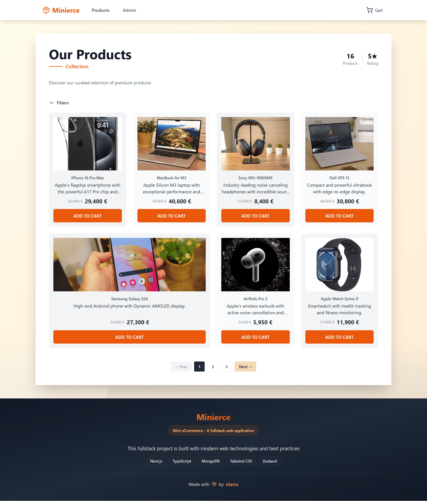

# Mini E-Commerce Platform

A modern e-commerce platform built with Next.js 15, TypeScript, Tailwind CSS, and MongoDB. Features product management, shopping cart, and responsive design.



## 🚀 Live Demo

**🌐 Main Application**: [https://minierce.vercel.app/](https://minierce.vercel.app/)

### 📱 Pages & Features
- **🏠 Home Page**: [Browse products](https://minierce.vercel.app/) with search and filtering
- **🛒 Cart Page**: [Manage shopping cart](https://minierce.vercel.app/cart) and checkout
- **📦 Product Details**: [View individual product](https://minierce.vercel.app/product/1) information
- **⚙️ Admin Dashboard**: [Manage all products](https://minierce.vercel.app/admin)
- **➕ Add Product**: [Create new products](https://minierce.vercel.app/admin/add)
- **✏️ Edit Product**: [Update existing products](https://minierce.vercel.app/admin/edit/1)

## 🚀 Features

### Customer Features
- Product browsing with pagination and filtering
- Shopping cart with quantity controls
- Checkout process with thank you message
- Responsive mobile-first design
- Real-time search functionality

### Admin Features
- Product management (add, edit, delete)
- Admin dashboard with search and pagination
- Form validation and error handling
- Image management via URLs

### Technical Features
- TypeScript for type safety
- MongoDB with Mongoose ODM
- Zustand for state management
- RESTful API for CRUD operations
- SEO optimized with proper meta tags

## 🔌 API Examples

### Get All Products
```bash
# cURL
curl -X GET "https://minierce.vercel.app/api/products?page=1&limit=10"

# Postman
GET https://minierce.vercel.app/api/products?page=1&limit=10
```

### Get Product by ID
```bash
# cURL
curl -X GET "https://minierce.vercel.app/api/products/1"

# Postman
GET https://minierce.vercel.app/api/products/1
```

### Get Product Count
```bash
# cURL
curl -X GET "https://minierce.vercel.app/api/products/count"

# Postman
GET https://minierce.vercel.app/api/products/count
```

### Create Product (Admin)
```bash
# cURL
curl -X POST "https://minierce.vercel.app/api/products" \
  -H "Content-Type: application/json" \
  -d '{
    "title": "New Product",
    "description": "Product description",
    "price": 99.99,
    "category": "Electronics",
    "imageUrl": "https://example.com/image.jpg"
  }'

# Postman
POST https://minierce.vercel.app/api/products
Content-Type: application/json

{
  "title": "New Product",
  "description": "Product description", 
  "price": 99.99,
  "category": "Electronics",
  "imageUrl": "https://example.com/image.jpg"
}
```

### Update Product (Admin)
```bash
# cURL
curl -X PUT "https://minierce.vercel.app/api/products/1" \
  -H "Content-Type: application/json" \
  -d '{
    "title": "Updated Product",
    "description": "Updated description",
    "price": 149.99,
    "category": "Electronics",
    "imageUrl": "https://example.com/updated-image.jpg"
  }'

# Postman
PUT https://minierce.vercel.app/api/products/1
Content-Type: application/json

{
  "title": "Updated Product",
  "description": "Updated description",
  "price": 149.99,
  "category": "Electronics", 
  "imageUrl": "https://example.com/updated-image.jpg"
}
```

### Delete Product (Admin)
```bash
# cURL
curl -X DELETE "https://minierce.vercel.app/api/products/1"

# Postman
DELETE https://minierce.vercel.app/api/products/1
```

## 🛠️ Tech Stack

- **Frontend**: Next.js 15, React 18, TypeScript
- **Styling**: Tailwind CSS, Lucide React Icons
- **State Management**: Zustand
- **Database**: MongoDB with Mongoose
- **Deployment**: Vercel-ready

## 📦 Quick Start

1. **Clone and install**
   ```bash
   git clone https://github.com/islamx/mini-ecommerce
   cd mini-ecommerce
   npm install
   ```

2. **Set up environment**
   Create `.env.local`:
   ```env
   MONGODB_URI=your_mongodb_connection_string
   ```

3. **Run development server**
   ```bash
   npm run dev
   ```

4. **Open browser**
   Navigate to [http://localhost:3000](http://localhost:3000)

## 🗄️ Database Setup

### MongoDB Atlas (Recommended)
- Create free MongoDB Atlas account
- Create new cluster
- Get connection string
- Add to `.env.local`

### Local MongoDB
- Install MongoDB locally
- Use: `mongodb://localhost:27017/ecommerce`

## 🚀 Deployment

### Vercel (Recommended)
1. Push to GitHub
2. Connect repository to Vercel
3. Add `MONGODB_URI` environment variable
4. Deploy!

## 📁 Project Structure

```
src/
├── app/                    # Next.js App Router
│   ├── admin/             # Admin pages
│   ├── api/               # API routes
│   ├── cart/              # Cart page
│   └── product/           # Product pages
├── components/            # React components
│   ├── admin/            # Admin components
│   ├── forms/            # Form components
│   ├── layout/           # Layout components
│   ├── products/         # Product components
│   └── shared/           # Shared components
├── lib/                  # Utilities
├── models/               # Database models
├── store/                # State management
└── types/                # TypeScript types
```

## 🔧 Development

```bash
npm run dev          # Start development server
npm run build        # Build for production
npm run start        # Start production server
npm run lint         # Run ESLint
```

## 🤝 Contributing

1. Fork the repository
2. Create a feature branch
3. Make your changes
4. Submit a pull request

## 👨‍💻 Developer

**Islam Abdelzaher**
- **Website**: [https://islamz.me](https://islamz.me)
- **GitHub**: [@islamz](https://github.com/islamz)

---

Built with ❤️ using Next.js, TypeScript, and Tailwind CSS
